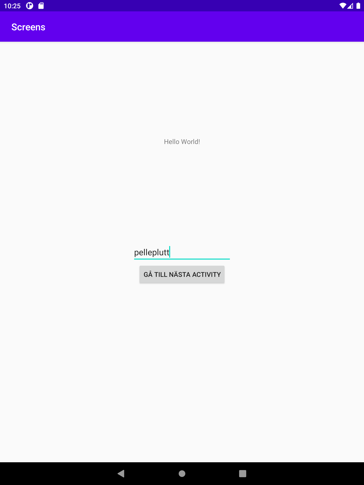
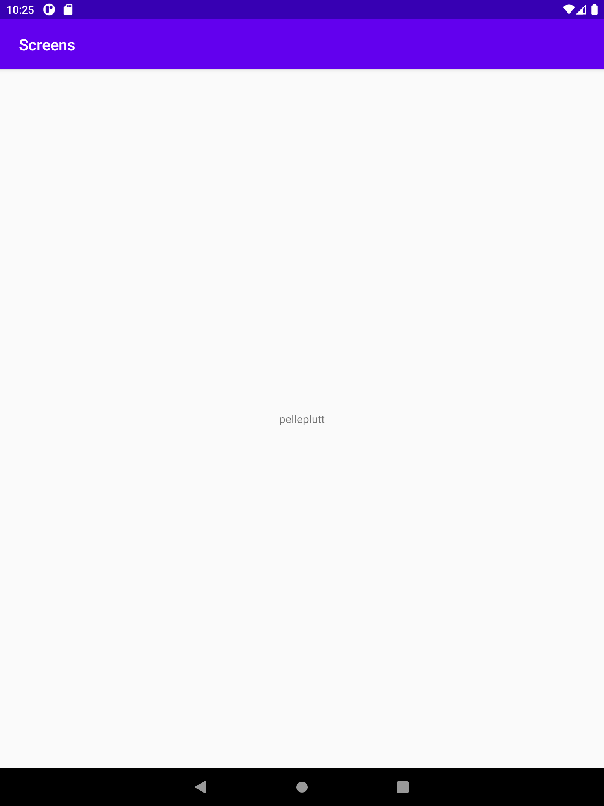

# Add a second activity #

- Jag tillfogade en till activity i samma mapp som huserade MainActivity, detta genom att högerklicka på mappen och skapa en till activity.

# Add a button in the first activity that starts the second activity #

- Denna knapp skapade jag först i activity_main.xml och stylade lite enligt underliggande kod

```
<Button
    android:id="@+id/button"
    android:layout_width="wrap_content"
    android:layout_height="wrap_content"
    android:text="Gå till nästa activity"
    app:layout_constraintEnd_toEndOf="parent"
    app:layout_constraintStart_toStartOf="parent"
    app:layout_constraintTop_toBottomOf="@id/username" 
/>
```

- Sedan hämtade jag denna till en privat variabel genom findViewById, sedan tillfogade jag en onClickListener på denna knapp och därmed en ny funktion "onCLick"
- Inom denna funktion så skapar jag en ny intent som hänvisar till den andra aktiviteten jag skapade tidigare.
- Detta genom att först skapa intenten sedan säger startActivity(intent) i denna onCLick-funktionen.

```
btn = findViewById(R.id.button);
username = findViewById(R.id.username);
btn.setOnClickListener(new View.OnClickListener() {
    @Override
    public void onClick(View view) {
        Log.d("==>", "Button Pressed");
        Log.d("==>", "Username:"+username.getText().toString());
        Intent intent = new Intent(MainActivity.this, SecondaryActivity.class);
        intent.putExtra("username", username.getText().toString());
        startActivity(intent);
    }
});
```

# Add data to the intent bundle using extras #

- I ovanliggande kodexempel så återses hur jag skickat med detta, jag skapade en EditText så användaren kan fylla in sitt användarenamn som sedan skickas vidare.
- Här hänvisas alltså den EditText till en privat variabel genom findViewById, sedan loggar jag den inmatade datan för avlusningsyfte samt skickar vidare denna i en text -> string format genom putExtra.

```
nameview = findViewById(R.id.usernameview);
Intent intent = getIntent();
Bundle extras = intent.getExtras();
string username = extras.getString("username");
Log.d("==>", "Username from intent:"+username);
    nameview.setText(username);
```

- Detta är från SecondaryActivity.java och visar på hur jag hämtar in datan som matades in. Här genom en getExtras och sedan tilldelar resultatet till string username, som jag sedan presenterar i en TextView inom SecondaryActivity.




